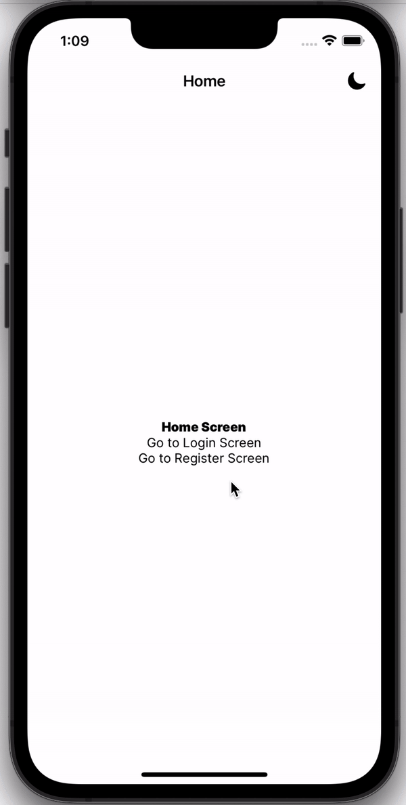
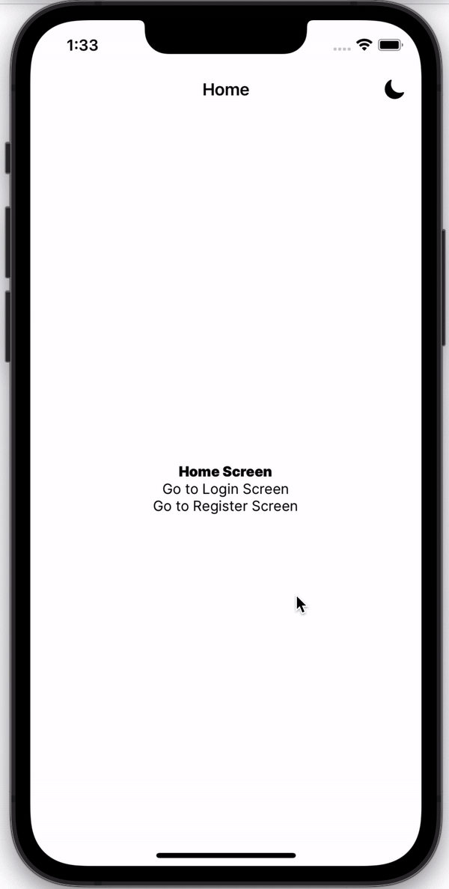
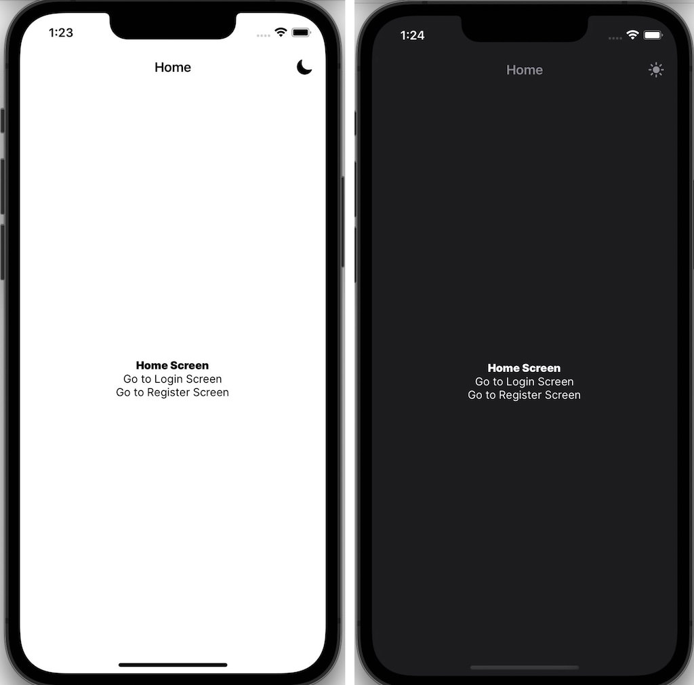
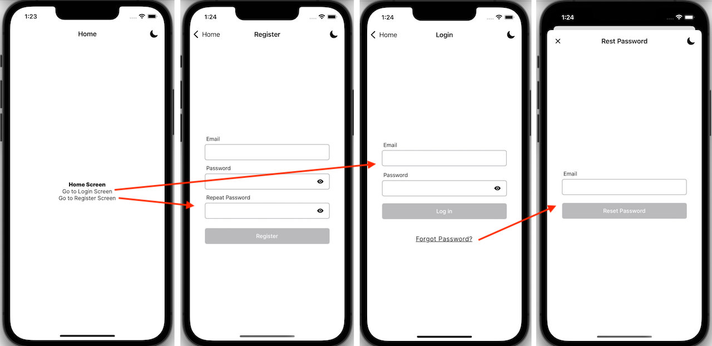
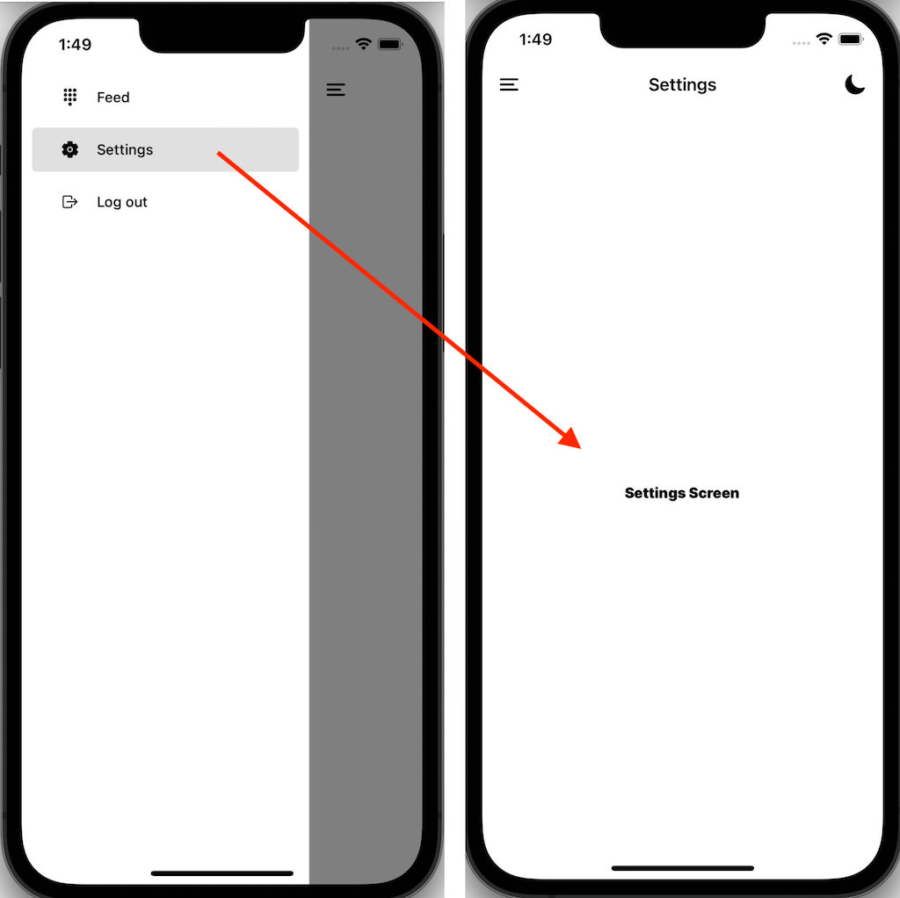
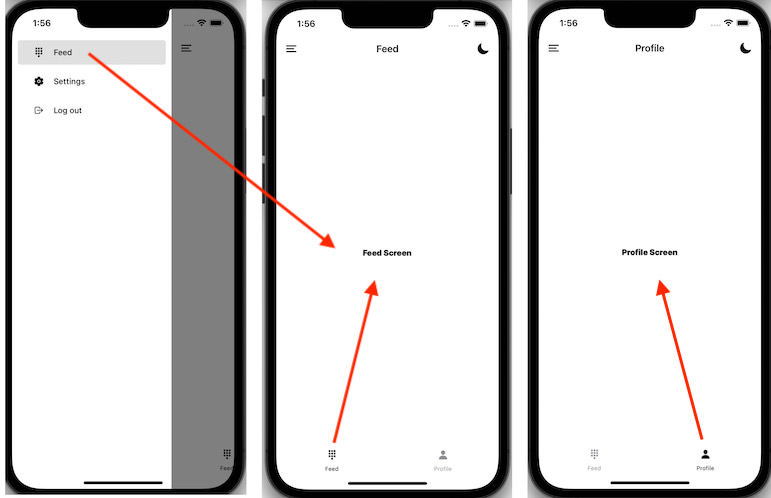
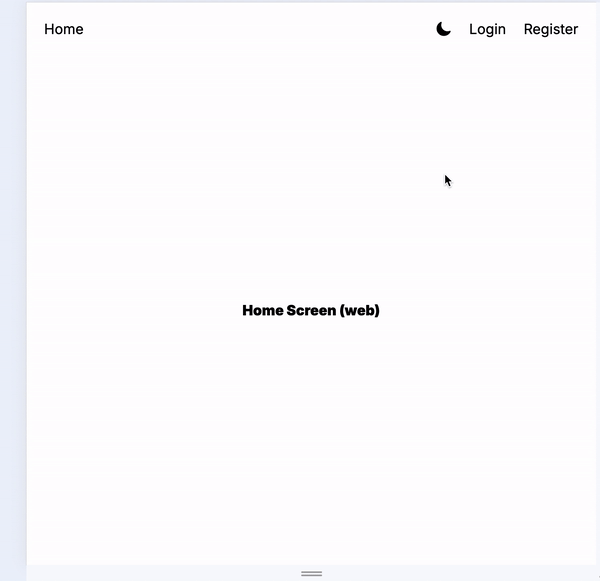
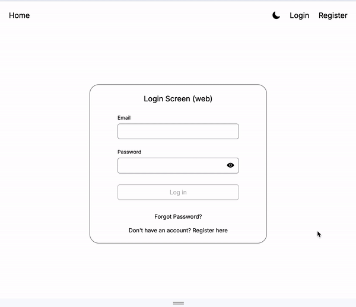

<!-- ./README.md -->

# Version 1 — Basic UI and Navigation

[expo-boilerplate-v1-frontend](https://github.com/panosjapan7/expo-boilerplate-v1-frontend)

## TECH STACK

- React Native, TypeScript, Expo v.50+. Expo Router, StyleSheet, CSS

## ROOT LEVEL (Stack Navigator)

## 1 LEVEL DOWN: Drawer Navigator / 2 LEVELS DOWN: Tabs Navigator

## FEATURES

- **Dark theme**
- **Fonts:** Google Font
  - _@expo-google-fonts dependency_
- **Forms:** Login, Register, Reset Password, Form Validation
- **Hooks:** Form Validation, Mouse Hover
- **Loading indicator**
- **Modal:** Alert modal with option for full screen background (mobile only)
- **Navigation (mobile):** Expo router (Stack > Drawer > Tabs)
  - _expo-router dependency_
- **Navigation (web)** Reponsive Top Navbar, Drawer menu
- **Offline Features:** Saves theme selection locally (web, mobile)
  - _@react-native-async-storage dependency_
- **Screens**
  - **Basic screens (mobile, web):** Home, Login, Register, Reset Password, Feed, Profile, Settings, Hidden
- **State Management:**
  - **React Context:** AuthContenxt, ThemeContext
- **Styling**
  - CSS (web), StyleSheet (mobile)
  - Global styling vars
  - _react-native-reanimated dependency_

## DARK/LIGHT THEME

### The light/dark theme can be toggled from all levels of navigation

## NAVIGATION

### MOBILE

#### Root Level (Stack):

- 1 Stack Navigator (`app/_layout`) with 4 Screens (`app/index`, `app/login`, `app/register`, `app/reset-password`)
- 1 Screen opens as a Modal (`reset-password`)
   
   
  
   
   

#### 1 Level Deep (Drawer):

- 1 Drawer Navigator (`app/(drawer)/_layout.tsx`)
- 1 screen (`app/(drawer)/settings`)
- Tabs navigator is not rendered on `settings` screen
   
   
  
   
   

#### 2 Levels Deep (Tabs):

- 1 Tabs Navigator (`app/(drawer)/(tabs)/_layout.tsx`) with 3 screens (`app/(drawer)/(tabs)/feed`, `app/(drawer)/(tabs)/profile`, `app/(drawer)/(tabs)/hidden`).
- The `hidden` screen is hidden from the Tab menu items
- The Drawer icon is visible and Drawer menu can be toggled
   
   
  
   
   

### WEB NAVIGATION

#### Responsive Navigation Bar

  
  
#### Protected Screens
All web screens are separate `.web.tsx` versions
  
